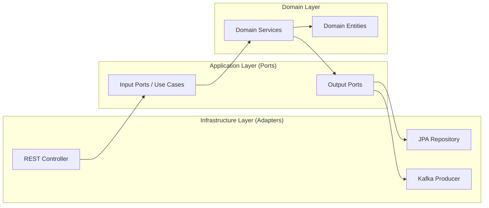

# Order Platform Project

This project is a robust, production-ready Order Management System built with **Java 21**, **Spring Boot 4.0.1**, and **Apache Kafka**. It is designed following the **Hexagonal Architecture** (Ports and Adapters) pattern to ensure a clean separation of concerns, high maintainability, and extensibility.

## 🚀 Key Features

- **Order Management**: Create and track order status (Created, Approved, Rejected).
- **Messaging Pipeline**: Real-time event communication using Kafka.
- **Hexagonal Architecture**: Strict decoupling of business logic from infrastructure.
- **Data Integrity**: Global exception handling and request validation.
- **Comprehensive Testing**: Unit testing with JaCoCo for code coverage.

## 🛠️ Tech Stack

- **Language**: Java 21 (LTS)
- **Framework**: Spring Boot 4.0.1
- **Messaging**: Apache Kafka
- **Database**: H2 (In-memory for development)
- **Persistence**: Spring Data JPA / Hibernate
- **API Documentation**: SpringDoc OpenAPI / Swagger
- **Testing**: JUnit 5, Mockito, JaCoCo

## 📐 Architecture Overview

The project adheres to the **Hexagonal Architecture** pattern, which divides the application into three main layers:



- **Domain Layer**: Contains the core business logic, entities, and domain services.
- **Application Layer**: Defines the input and output ports (interfaces) and use cases.
- **Infrastructure Layer**: Implements the technical details, such as database interaction, messaging, and REST controllers.

## 📋 Prerequisites

Before you begin, ensure you have the following installed:
- **Java 21**
- **Maven**
- **Docker** and **Docker Compose**

## ⚙️ Getting Started

### 1. Clone the repository
```bash
git clone <repository-url>
cd order-platform
```

### 2. Infrastructure Setup (Local Development)
This project uses Docker to run Kafka locally.

**Start Kafka:**
```bash
docker-compose up -d
```

**Create Required Kafka Topics:**
Run these commands to manually create the topics needed for local testing:

```bash
docker exec -it kafka kafka-topics --bootstrap-server localhost:9092 --create --topic order.created --partitions 1 --replication-factor 1
docker exec -it kafka kafka-topics --bootstrap-server localhost:9092 --create --topic order.approved --partitions 1 --replication-factor 1
docker exec -it kafka kafka-topics --bootstrap-server localhost:9092 --create --topic order.rejected --partitions 1 --replication-factor 1
```

### 3. Build and Run
```bash
mvn clean install
mvn spring-boot:run
```

The application will be available at `http://localhost:8080`.

## 📖 API Documentation

Once the application is running, you can access the interactive Swagger UI at:
`http://localhost:8080/swagger-ui/index.html`

## 🧪 Testing and Coverage

To run the unit tests and generate the JaCoCo coverage report:
```bash
mvn test
```
The report will be generated at: `target/site/jacoco/index.html`

---
*Created by [Elkin Latorre](https://github.com/elkinlatorre)*
